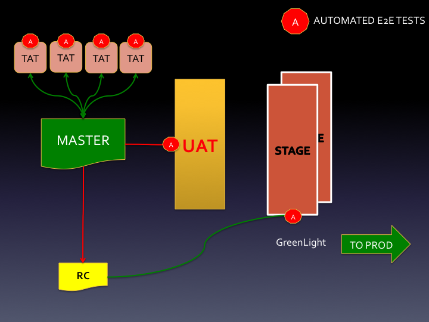
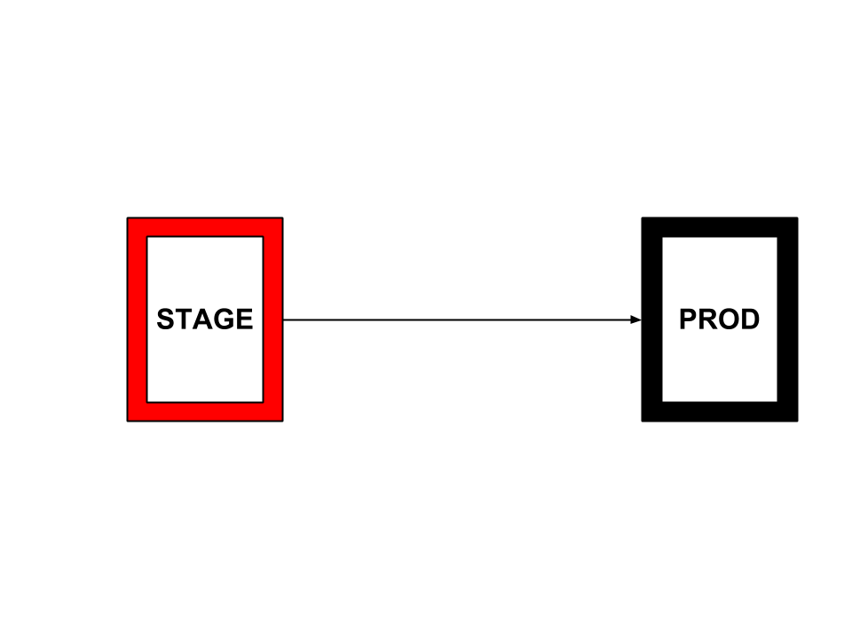

# Angie's List Pre-2013 ways of Pushing Code to Production

### Created by [Balaji Vajjala](https://bvajjala.github.io) / [@BVajjala](https://twitter.com/Bvajjala)

## Principal DevOps Consultant/Solution Architect

  Hi, my name is Balaji Vajjala and I'm the Chief DevOps Solution Architect here at Angie's List. Today  Here I will be talking about how we implemented a Continuous Deployment pipelines, DevOps Culture and other Misc Topics.
  Hope you will enjoy this presentation.

## Who Am I?

* A Full Stack DevOps Engineer/Solution Architect for last 10+ years!
* Original !sysadmin! and !Developer! since late 90's 
* Now working at Angie's List and Certainly Not a professional speaker

### Pre-2013 Release Process

* Invalid hardware, os, software and configurations on Stage01 and Stage02. This should keep us up at night. At times we literally close our eyes and pray.
* Improper use of Git. (Manually merging team branches into release candidates, no use of Master/Release.)
* Some teams had team testing environments, not all. Very old, slow machines. With 9 QA environments of varying quality of hardware, OS, software, it was near impossible to properly regression test.

### Pre-2013 Release Process

* Too many QA environments caused confusion as to what version of code was where. 
* Due to the vagaries between environments, "Greenlight" testing needs to take place in QA, Stage, and Prod. An extreme waste of time and resources.
* No integration with Python apps. To be fair, up until February 2013, no true integration was needed, as .NET and Python development could happen in isolation.
* No performance testing.

### Pre-2013 Release Process

### Pre-2013 Release Process

### Pre-2013 Release Process

### Pre-2013 Release Process

### Pre-2013 Release Process

### Pre-2013 Release Process

### New Release Process

### New Release Process

### New Release Process

### New Release Process

### New Release Process

### New Release Process

### New Release Process

### New Release Process

### New Release Process

### New Release Process

### New Release Process

### New Release Process

### New Release Process

### New Release Process

### New Release Process

## My Social Media Presence

  * [My LinkedIn Profile](https://www.linkedin.com/in/bvajjala)
  * [My Twitter Handle](https://twitter.com/Bvajjala)
  * [My Blog](https://bvajjala.github.io/)
  * [My Facebook Profile](https://www.facebook.com/bvajjala)
  * [My Resume](https://bvajjala.github.io/about/resume/)
  * [Contact me](mailto:bvajjala@gmail.com)

## The End