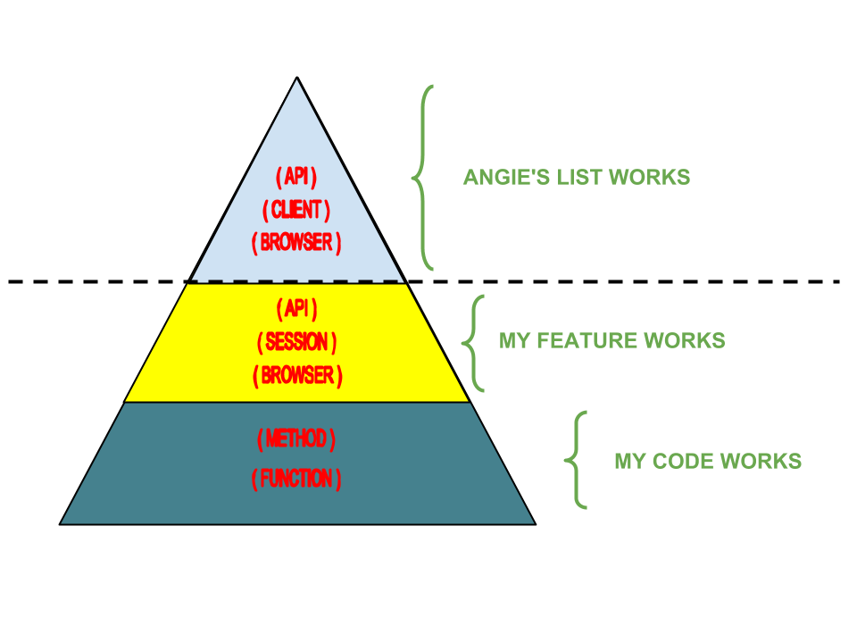
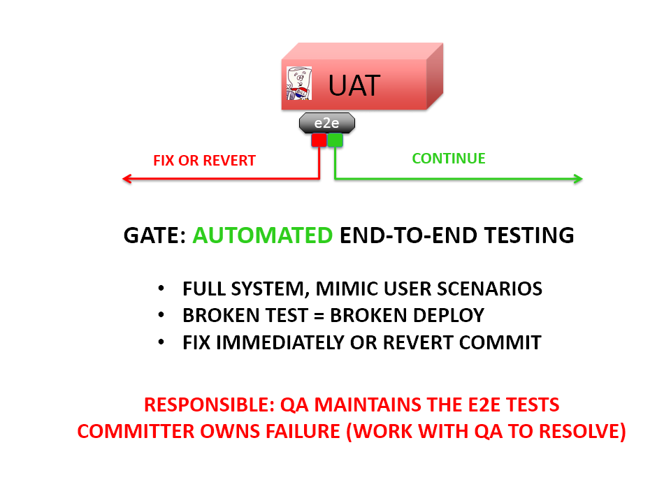
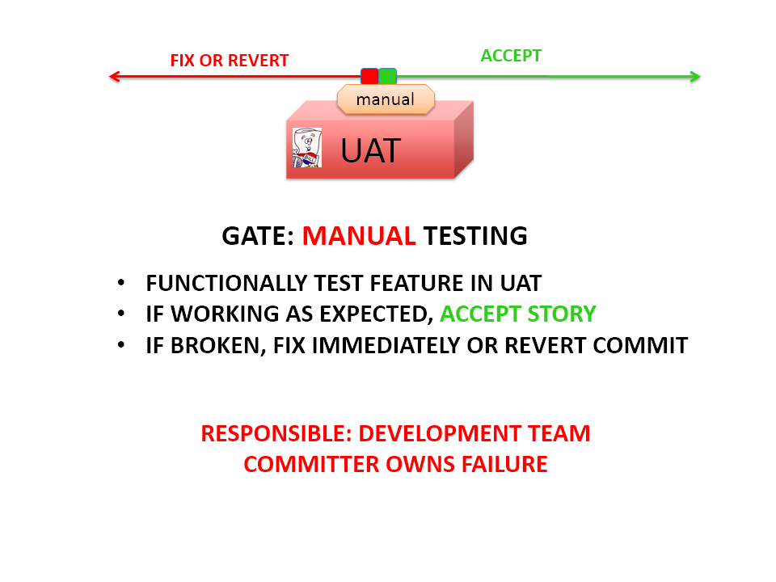
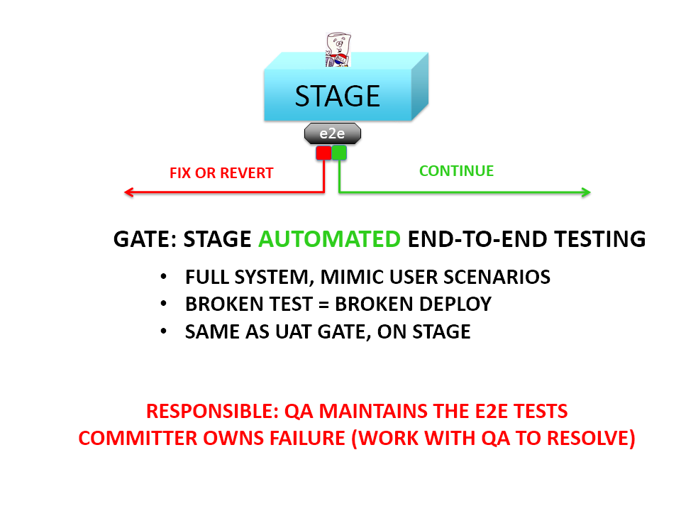
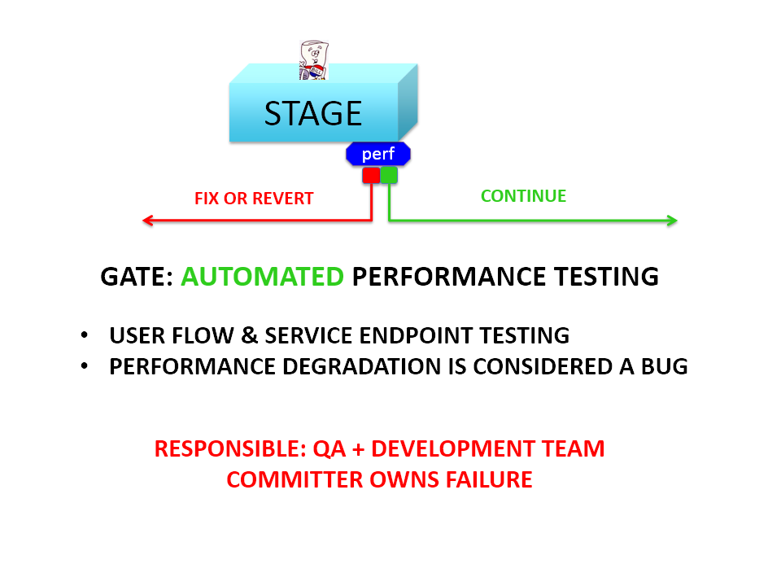
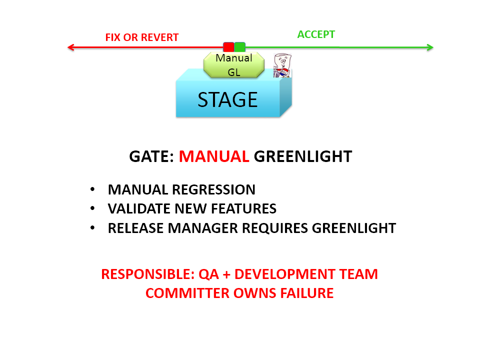
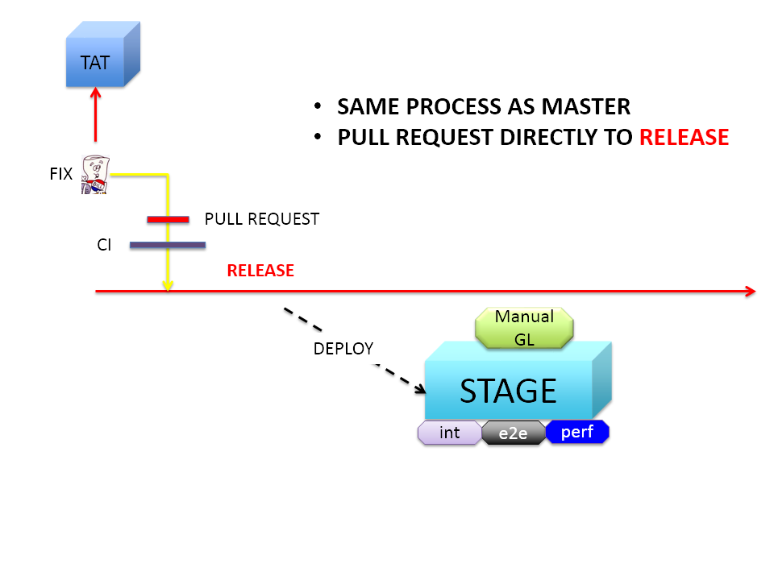

# Balaji Vajjala

### Created by [Balaji Vajjala](https://bvajjala.github.io) / [@BVajjala](https://twitter.com/Bvajjala)

## Principal DevOps Consultant/Solution Architect

  Hi, my name is Balaji Vajjala and I'm the Chief Architect and DevOps Solution Architect. Here I will be talking about implementing a Practical Continuous Deployment pipelines, DevOps Culture and other Misc Topics.
  Hope you will enjoy these

## Who Am I?

* A Full Stack DevOps Engineer/Solution Architect for last 10+ years!
* Original !sysadmin! and !Developer! since late 90's 
* Now working out of East Coast and Certainly Not a professional speaker

# Pre Agile Implementation

## CI Jenkins

## Code to Prod

# Angies List 

 

 

 

 

 

 

 

 

 

 

 

 

 

 

 

 

 

 

 

 

 

 

## My Social Media Presence

  * [My LinkedIn Profile](https://www.linkedin.com/in/bvajjala)
  * [My Twitter Handle](https://twitter.com/Bvajjala)
  * [My Blog](https://bvajjala.github.io/)
  * [My Facebook Profile](https://www.facebook.com/bvajjala)
  * [My Resume](https://bvajjala.github.io/about/resume/)
  * [Contact me](mailto:bvajjala@gmail.com)

## The End

