# Angie's List Code TO Production process

### Created by [Balaji Vajjala](https://bvajjala.github.io) / [@BVajjala](https://twitter.com/Bvajjala)

## Principal DevOps Consultant/Solution Architect

  Hi, my name is Balaji Vajjala and I'm the Chief DevOps Solution Architect here at Angie's List. Today  Here I will be talking about how we implemented a Continuous Deployment pipelines, DevOps Culture and other Misc Topics.
  Hope you will enjoy this presentation.

## Who Am I?

* A Full Stack DevOps Engineer/Solution Architect for last 10+ years!
* Original !sysadmin! and !Developer! since late 90's 
* Now working at Angie's List and Certainly Not a professional speaker

# Code to Production

## 1 DEVELOP COde

 a.  Team / Feature branches
    i. feature code
    ii. unit tests
    iii.    developers are responsible for merging master into their development branch, to avoid merge conflicts later on. A poor or forgotten merge will be caught by the CI compilation and testing process
    iv. team lead and peer review should be an ongoing team task for all features in development
  b. GATE: TAT (team testing environment)
     i. team deploys code to team environment
     ii. test
     iii. if fail... fix, redeploy, test
     iv. if pass... merge to master

## 2. MERGE TO MASTER

   a. GATE: Pull requests for master.
      i. developer will submit a pull request for master, a signal to code reviewer to review/approve code
      ii. team/tech leads: check for code completeness, intent, quality, unit tests
      iii. if fail... fix, test, review
      iv.  if pass... push to CI
   b. GATE: Push to CI
      i. failing unit tests... code not merged
      ii. broken code coverage... code not merged
      iii. all good... master merge is complete

## 3. UAT (shared, central test environment for day-to-day testing)

   a. push master twice daily (or on demand)
   b. full production parity on apps/services/JAMS
   c. GATE: automated integration testing
     i. failed test... broken deploy
       1. go back to STEP 1. Fix, test, push to CI, redeploy to UAT... e2e tests run again
   d. GATE: automated end-to-end testing
     i. failed test... broken deploy
        1. go back to STEP 1. Fix, test, push to CI, redeploy to UAT... e2e tests run again
  e. GATE: manual integration testing (team)
     i. if success, mark feature/bug ticket as tested... move on to next backlog item
     ii. if fail... repeat fix, test, pull request, push to ci process (back to STEP 1)

### DAY-TO-DAY LIFE OF A CODE SUBMISSION
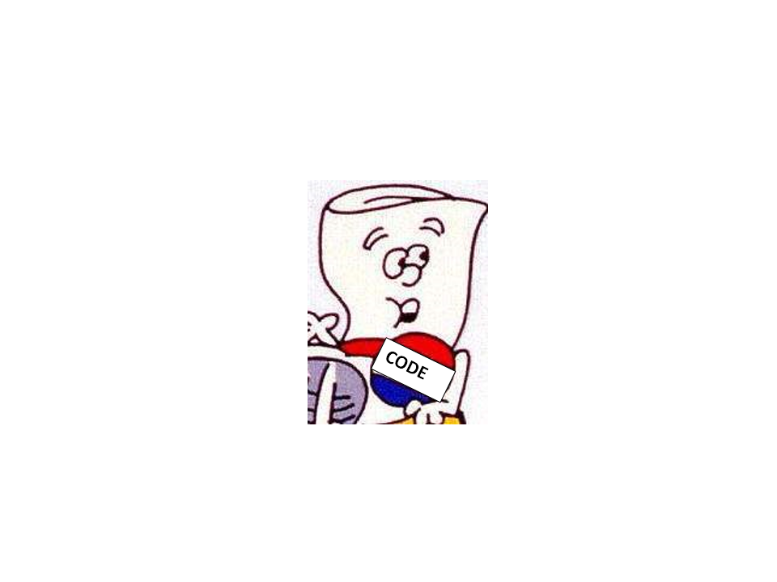

### DAY-TO-DAY LIFE OF A CODE SUBMISSION
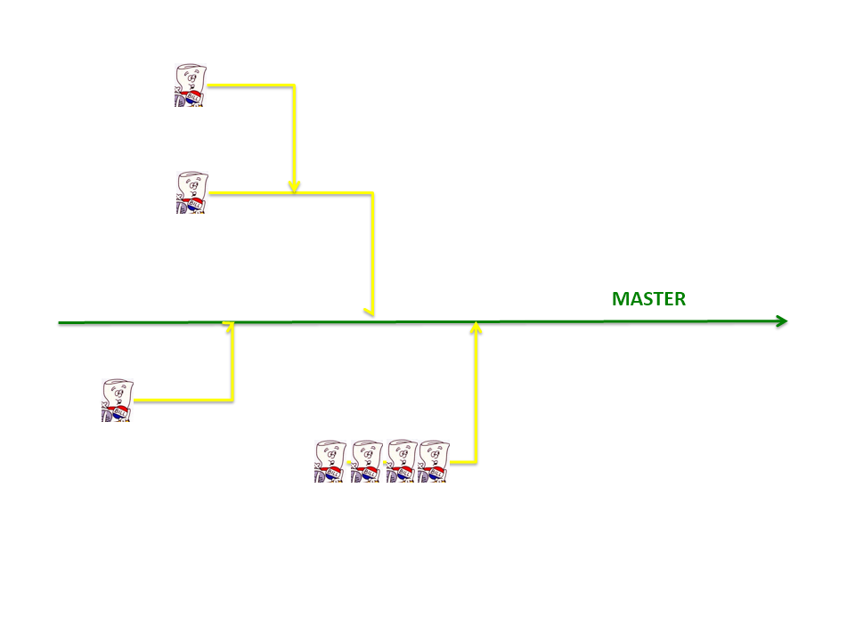

### Angie's List Git Workflow and merge process

### Angie's List Git Workflow and merge process
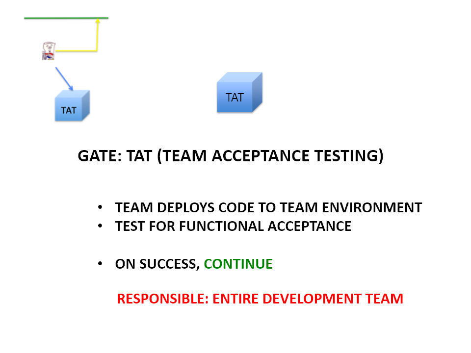

### Angie's List Git Workflow and merge process
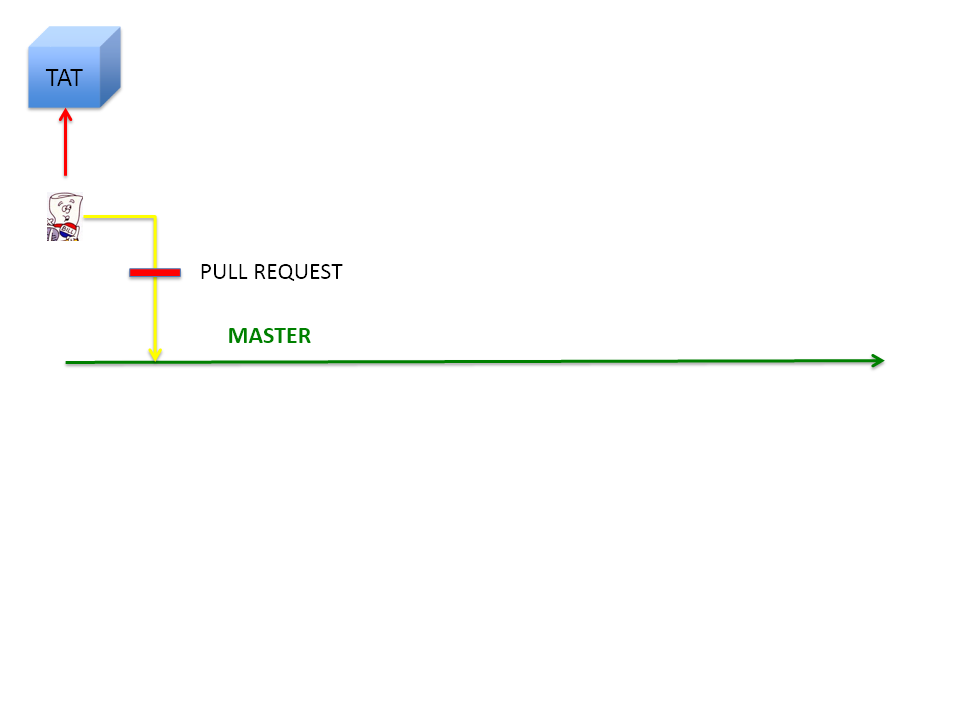

### Angie's List Git Workflow and merge process
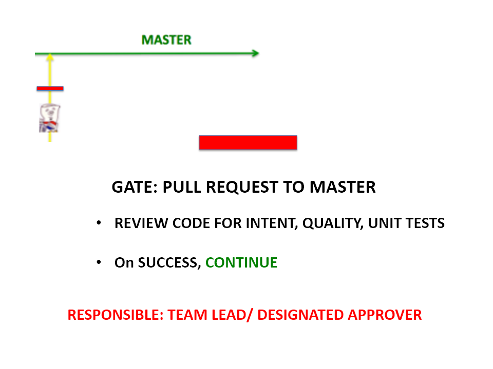

### Angie's List Git Workflow and merge process

### Angie's List Git Workflow and merge process
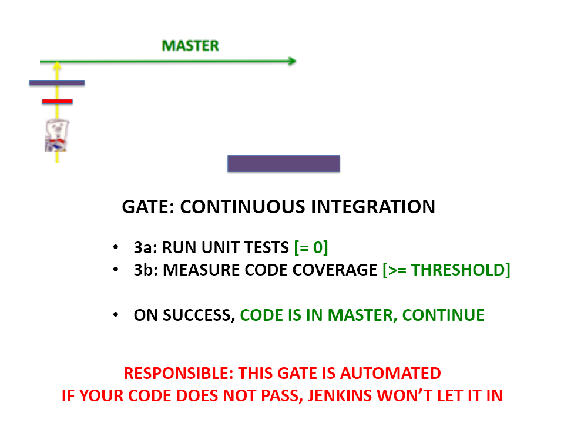

### Angie's List Git Workflow and merge process

### Angie's List Git Workflow and merge process
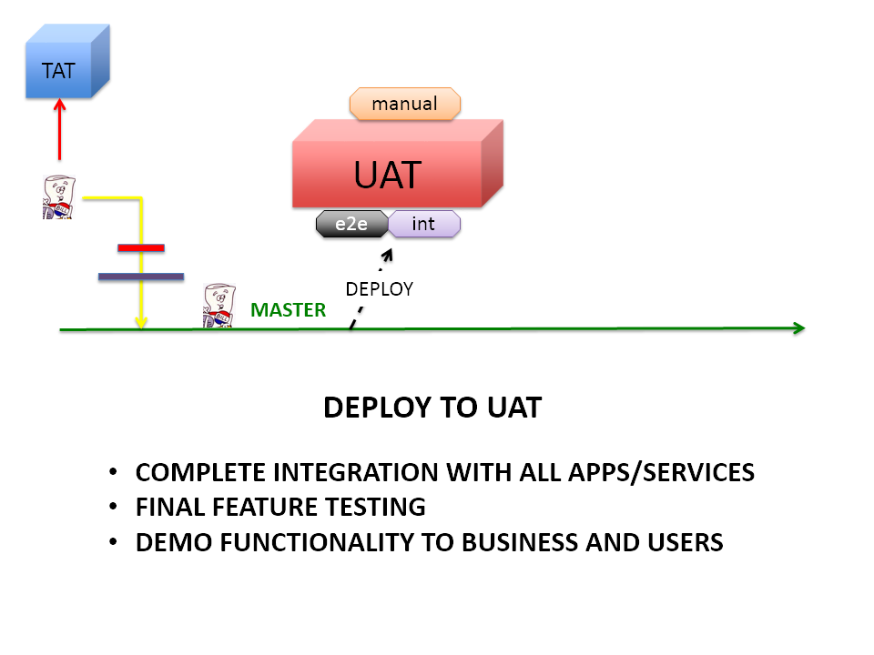

### Angie's List Git Workflow and merge process

### Angie's List Git Workflow and merge process

### Angie's List Git Workflow and merge process

## RELEASE

1. Predetermined code complete date (every other Friday currently)
2. Cut Release branch morning of code complete... deploy to STAGE
3. STAGE
a. GATE: Automated Integration testing
   i. failed test -> broken deploy
b. GATE: Automated End-to-End testing
   i. failed test -> broken deploy
c.  GATE: Automated performance testing
   i. verify no performance degradation in proposed code changes
   ii. if performance degradation occurs... fix, test, push to ci for release branch, pull request to release branch, deploy to STAGE, verify fix

## Release
d. If fix needed
   i. fix in feature branch
   ii. test in TAT
   iii. GATE: Push to CI (for release branch)
       1. failing unit tests... build fails
       2. broken code coverage... build fails
   iv. GATE: create pull request to release branch
       1. release manager: approves pull request
       2. build & release: merges pull request
   v. build & release team: deploy change to STAGE
   vi. developer and team: verify fix on STAGE
   vii. developer: merge change back to master(warning)
e. GATE: Manual greenlight testing
   i. if pass... notify release manager of successful greenlight
   ii. if bugs found, prioritize
       1. if critical... fix, test, push to ci for release branch, pull request to release branch, deploy to STAGE, verify fix
f. Deploy to PRODUCTION on successful GL

4. GATE: Deploy verification testing in PRODUCTION

### Release
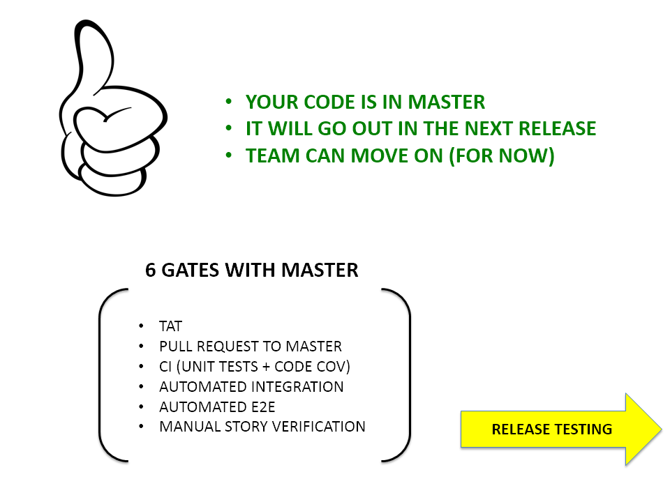

### Release
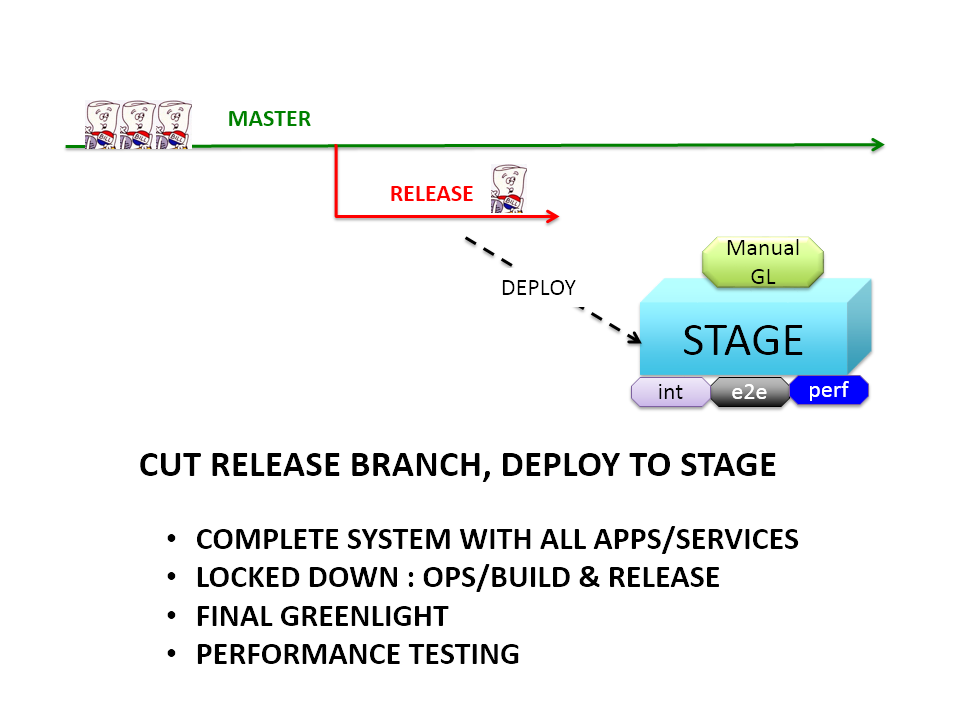

### Angie's List Git Workflow and merge process
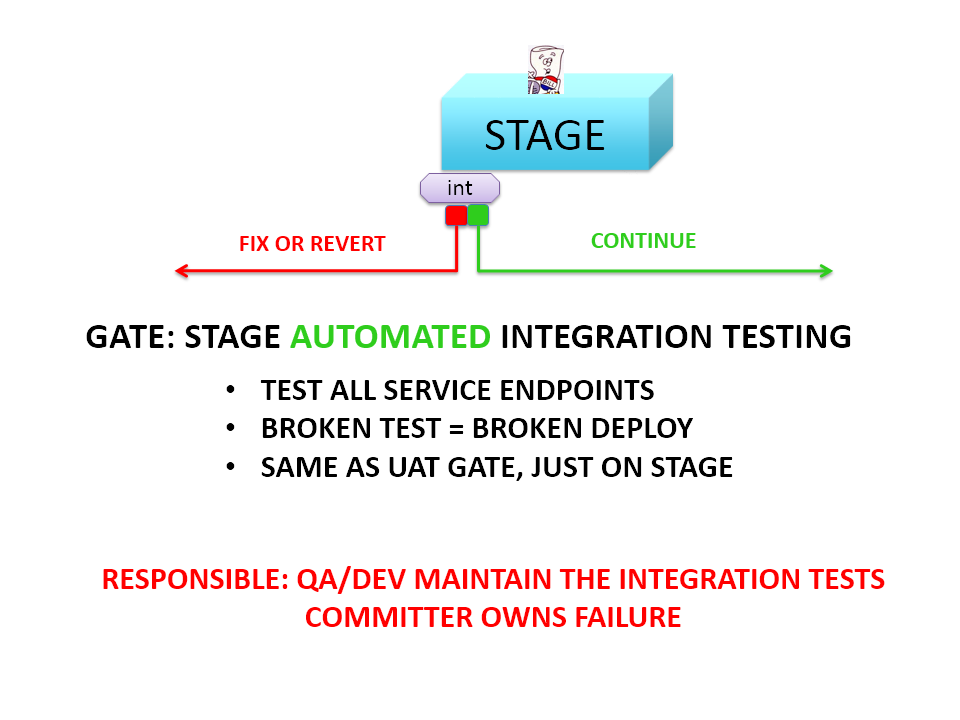

### Angie's List Git Workflow and merge process

### Angie's List Git Workflow and merge process

### Angie's List Git Workflow and merge process

### Angie's List Git Workflow and merge process
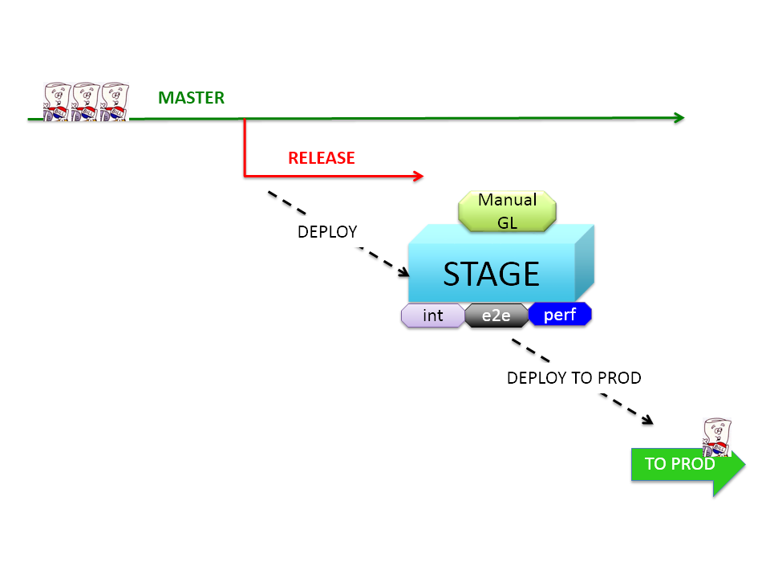

### Angie's List Git Workflow and merge process
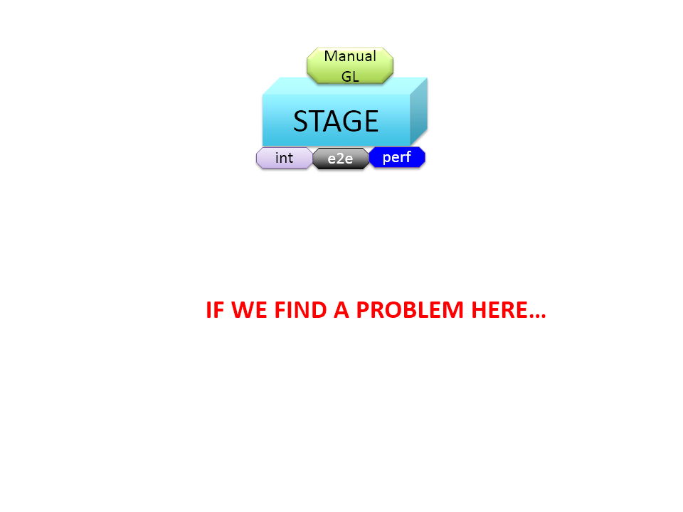

## HOT PATCH RELEASE
1. A critical issue is found in production and needs to be resolved as soon as possible

2. Fix in feature branch
   a. test in TAT
   b. code review with team lead or designated approver
   c. GATE: Push to CI (for release branch)
       i. failing unit tests... build fails
       ii. broken code coverage... build fails
   d. GATE: create pull request to release branch
       i. release manager: approves pull request
       ii. build & release: merges pull request
       iii. build & release team: deploy change to STAGE
   e. GATES FOR INTEGRATION, E2E, AND PERFORMANCE WILL REPEAT AS NORMAL
   f. developer and team: verify fix on STAGE
   g. developer: merge change back to master(warning)
3. GATE: Manual greenlight testing
   a. if pass... notify release manager of successful greenlight
   b. if more bugs found, prioritize
   i. if critical... fix, test, push to ci for release branch, pull request to release branch, deploy to STAGE, verify fix (ie. start over)
4. Deploy to PRODUCTION on successful GL
5. GATE: Deploy verification testing in PRODUCTION
   a. QA Director and Engineering Managers accountable for production code.

### Angie's List Git Workflow and merge process

### Angie's List Git Workflow and merge process
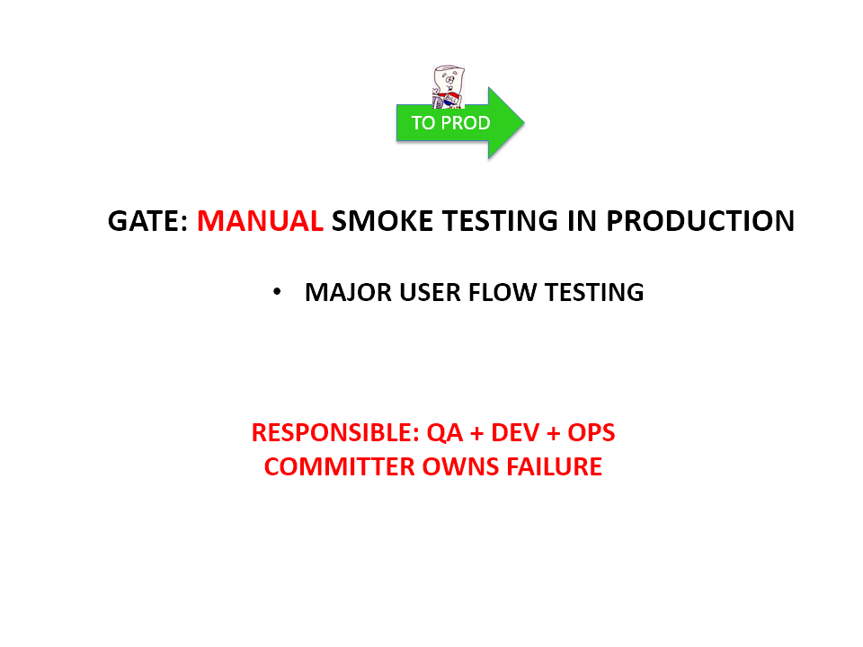

### Angie's List Git Workflow and merge process
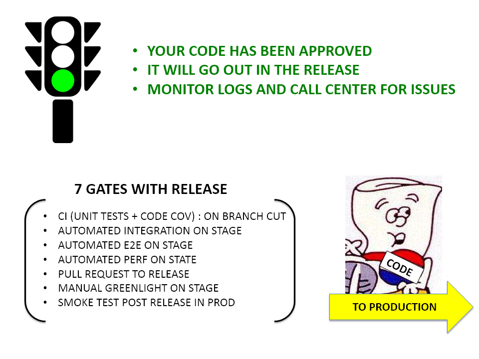

## My Social Media Presence

  * [My LinkedIn Profile](https://www.linkedin.com/in/bvajjala)
  * [My Twitter Handle](https://twitter.com/Bvajjala)
  * [My Blog](https://bvajjala.github.io/)
  * [My Facebook Profile](https://www.facebook.com/bvajjala)
  * [My Resume](https://bvajjala.github.io/about/resume/)
  * [Contact me](mailto:bvajjala@gmail.com)

## The End